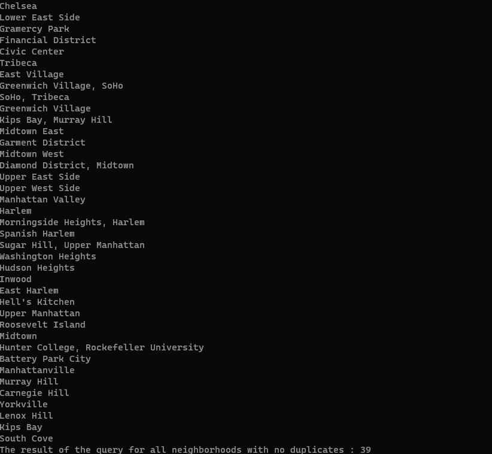

# LINQ in Manhattan

this is a program displaying information grapped from manhatten and showcases this data with different ways and the code includes basic structure for using LINQ

## visuals

## Guide

This is a static program meaning that the user cannot interact with it. it is only meant to display the data and for the code itself to serve as a small guide in learning LINQ

## other details

the first set of data displays all neighborhood names(even including empty names!)
the second set of data displays all neighborhood names(excluding empty names)
the third set of data displays all neighborhood names(only showing distinct names)
the forth set of data displays all neighborhood names(exact same result as first but written in a different way)
